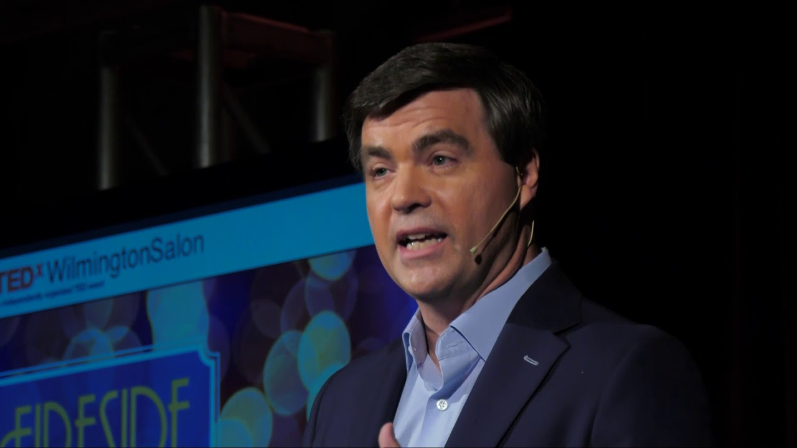

# Introduction to sales

It is likely that you might be afraid of the word _sales_ or that you find it to be an unpleasant procedure... and that is true for some manipulative high-pressure selling techniques. In our case, however, we will try to redefine this concept into a set of skills that will make you want to sell---a completely different concept.

The following video explains this new approach to sales, but let us summarise the contents here. 

## Sales is about guidance and love ❤️

Instead of focusing on manipulating, pitching or convincing, you should think of sales as
- a way to help the clients reach a decision 

and how do you do this?
- by going through their challenges
- by caring and asking questions

In the end, you want the client to leave in a better mood than at the beginning of the interation. 
- The best salespeople are good listeners, not good talkers

### Serve

You need to want to help your clients even if you don't get to sell them anything, and you need to do this by shifting the mindset from you to them:
- **It is not about you can do, it is about what they need**

so you need to have the clients best interest in mind, even if you are not the answer.

### Ask

Better ask than advise, you want to find out the clients needs. Most of the times even the clients don't have a clear problem in their head or they even tell you about a problem that is not the real problem, so you need to guide them through conversation to detect the bottlenecks.

### Listen

Really listen and transmit that you are listening, maybe nodding, maybe some sound, maybe take notes if it seems appropriate.

### Empathize

Understand to the client's pain and focus on the feeling, not always on the problem. You need to acknowledge the client's feeling.

### Summarize

Don't be afraid of summarizing the insights that you got, it is better to leave with the correct ideas rather than faking you understood and got a wrong interpretation. This will allow you to polish the details.

## Closing: the Condition/Hypothetical Close

In order to close a deal, it is important that you help the client think that the final decision is a smaller step than it seems and also without any commitment. And you do this by guiding them through a path of hypothetical smaller steps until reaching a conclusion.

[Link to video (starts at 2:10)](https://youtu.be/my_p1fDOz00?t=129)

[Link to video](https://www.youtube.com/watch?v=fqdaRXQjTUE)
